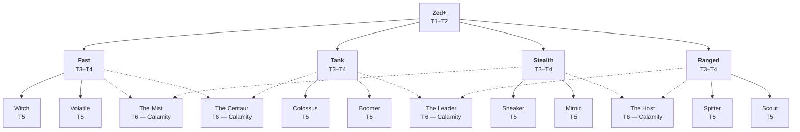

# ZED+

**A Project Zomboid mod — Build 42**

Design Bible — special enemy system, evolution tree and behaviours.

> ⚑ 4 open points still to be decided — see [Open points](#open-points).

---

## Contents

- [Spawn mechanics](#spawn-mechanics)
- [Evolution tree](#evolution-tree)
- [T1–T2 · Reinforced Zombie](#t1t2--reinforced-zombie)
- [T3–T4 · Paths](#t3t4--paths)
- [T5 · Final forms](#t5--final-forms)
- [T6 · Calamities](#t6--calamities)
- [Easter Egg · Thriller](#easter-egg--thriller)
- [Open points](#open-points)
- [License](#license)
- [Support](#support)

---

## Concept

Ordinary zombies are secretly "infected" from the moment they spawn. A Zed+ looks exactly like any other zombie until
tier 5 — the danger is that you cannot tell which one it is until it acts.

---

## Spawn mechanics

The initial tier (T1–T4) is decided at spawn time from the current apocalypse day. From T4 onward, dynamic evolution
becomes possible: the zombie attempts to become a Calamity if the zone conditions are met, or evolves into a T5 after
four days of survival if it cannot. **T4 is a transitional form** — it is looking for its next outcome.

| Rule | Value |
|---|---|
| **Spawn rate** | ~1 Zed+ per 400 ordinary zombies |
| **Tier thresholds (at spawn)** | T1–T2: day 0+ · T3–T4: day 7+ · T5: via T4, 4 days of survival · T6: via T4, zone conditions |
| **T4 → T5 condition** | A T4 that could not become a Calamity evolves into a T5 after **4 days of survival** in the world |
| **T4 → T6 condition** | No Calamity within a **150-tile** radius *and* **≥ 25 zombies** in the zone *(configurable)* |
| **Regional exclusion** | Only one active Calamity per 150-tile radius. **Permanent refusal** if the slot is taken — the T4 can never try again |
| **Pre-placed Calamities** | Some Calamities are fixed at world generation near landmark buildings. They occupy the regional slot exactly like a living Calamity |

---

## Evolution tree

- **Solid line** — `T4 → T5`: after 4 days of survival
- **Dashed line** — `T4 → T6`: if the zone conditions are met (skips T5 entirely)

---

## T1–T2 · Reinforced Zombie

**Day 0+**

Indistinguishable from an ordinary zombie — same appearance, same sounds, same apparent behaviour. Slightly higher
stats. The player has no way of knowing they are facing a Zed+. Custom outfits and distinctive behaviour only appear
from T5 onward.

---

## T3–T4 · Paths

**Day 7+ · Specialisations**

Differentiation is **behavioural only** — the Zed+ still looks exactly like an ordinary zombie. The path is rolled
randomly at spawn and determines which T5 forms are reachable.

| Path | Behaviour |
|---|---|
| **Fast** | Faster than normal, less resistant. *Visually identical to a normal zombie.* Only its speed gives it away. |
| **Tank** | Considerably slower, but far more resistant. *Visually identical to a normal zombie.* Hard to tell apart without attacking it. |
| **Stealth** | Only aggros at very close range. Stays prone or motionless in building corners. *Normal appearance and sounds.* |
| **Ranged** | Emits a putrefaction gas. *Normal appearance.* Unusual corpse sickness in the area may tip off an attentive player. |

---

## T5 · Final forms

**Day 21+ · Mini-bosses**

The final form is rolled randomly between the two options of the path. Behaviour is entirely distinct.

### Fast path

#### Witch — *Passive and dangerous*

| Speed | Resistance | Aggro |
|---|---|---|
| ×1.5 | Normal | Conditional |

Stays motionless, sitting or standing, until a player makes too much noise nearby, shines a light directly on her, or
gets too close. She then lets out a single scream and charges without ever disengaging.

> **Key mechanic** — Once aggroed, the pursuit is permanent: even if the player gets into a car and drives away, the
> Witch holds the chase indefinitely.

#### Volatile — *Airborne biological drone* ⚑

| Speed | Resistance | Flight |
|---|---|---|
| Fast | Low | Yes |

Moves in simulated flight, crossing fences and palisades. As soon as it spots a player it emits 2–3 alert screams to
draw in the zombies of the area, then dies naturally.

> **Key mechanic** — Flight: crosses all fences and tall fences. Does not attack — its only role is to raise the
> alarm before expiring.

> ⚑ **To be decided** — lifespan after the alert.

### Tank path

#### Colossus — *A slow wall of flesh*

| Speed | Resistance | Stagger |
|---|---|---|
| Very slow | Very high | Almost none |

Moves slowly and inexorably toward the player. Stagger barely affects it — hitting it repeatedly will not push it
back.

> **Resistances** — `×2` damage from bladed weapons · `×0.5` from blunt weapons

`Weakness: bladed ×2` · `Resistance: blunt ×0.5`

#### Boomer — *Walking bomb* ⚑

| Speed | Resistance | Threat |
|---|---|---|
| Extremely slow | High | Explosion |

Heads slowly toward the player once it spots them. At 4–5 tiles it stops and screams. The explosion follows four
seconds later.

> **Explosion** — Heavy direct damage plus an acid splash on nearby cells (same effect as the Spitter).

> ⚑ **To be decided** — unify the acid effect with the Spitter.

### Stealth path

#### Sneaker — *Always behind you*

| Speed | Resistance | Sound |
|---|---|---|
| Moderate/fast | Normal | Breathing |

Actively works to hold a position behind the player. It does not make the usual guttural sounds — only laboured
breathing, audible if you listen for it.

> **Detection** — The player can locate it by the sound of its breathing. No growling, no conventional audio cue.

#### Mimic — *The corpse that waits* ⚑

| Speed | Resistance | Wake trigger |
|---|---|---|
| Crawling | Normal | Search / contact |

Lies prone on the ground, indistinguishable from an ordinary corpse. Wakes up if the player walks directly over it or
tries to loot it. It knocks the player down (resisted based on fitness) and attacks their feet.

> **After waking** — Becomes a permanent crawler until it goes dormant again. Can return to its dormant state if the
> player moves far enough away.

> ⚑ **To be decided** — exact conditions for going dormant again.

### Ranged path

#### Spitter — *Acid area control*

| Speed | Resistance | Range |
|---|---|---|
| Moderate | Normal | Ranged |

Throws persistent acid pools onto the ground. A player who stays 0.5 seconds in a pool triggers the effects:
equipment corrosion and burns on uncovered body parts.

> **0.5 s delay** — The player can cross the area quickly without damage; the penalty targets those who fail to
> react. Pools have a limited lifetime.

#### Scout — *Living alarm*

| Speed | Resistance | Alert |
|---|---|---|
| Fast | Low | Very wide |

The moment it spots a player it sprints toward them while screaming continuously. Its scream draws zombies over a
range comparable to a gunshot.

> **Ranged role** — The danger is not the Scout itself, it is the horde it summons. Killing it quietly before it
> screams is the priority.

---

## T6 · Calamities

**4 Calamities · Special T4 → T6 route**

One Calamity per region (~150-tile radius). The T4→T6 transition skips T5 entirely — it is the T4's first choice, but
the conditions must be met. **A refused T4 can never try again**: it stays T4 until it dies, or evolves into a T5
after four days. Some Calamities are pre-placed at world generation near landmark buildings.

Each Calamity inherits two classes; each class appears in exactly two Calamities.

| Calamity | Classes | Reachable from |
|---|---|---|
| **The Host** | Stealth + Ranged | T4 Stealth or T4 Ranged |
| **The Mist** | Fast + Stealth | T4 Fast or T4 Stealth |
| **The Leader** | Tank + Ranged | T4 Tank or T4 Ranged |
| **The Centaur** | Fast + Tank | T4 Fast or T4 Tank |

### The Host — *Zombie factory*

`Stealth · Ranged`

| Speed | Resistance | Attack |
|---|---|---|
| Immobile | Extreme | None |

Lies on the ground, indistinguishable from an ordinary corpse. Unable to move or attack. While alive it continuously
spawns T1–T2 Zed+ whenever a player approaches or a loud noise is heard (gunfire, helicopter…). Its Stealth nature
makes it hard to spot; its Ranged nature gives it a wide spawning radius.

> **Priority** — It has to be killed to stop the flow, and it is very hard to kill without being overrun by its own
> creations.

### The Mist — *Living smoke grenade*

`Fast · Stealth`

| Speed | Resistance | Area |
|---|---|---|
| Fast | Low | Dense smoke |

Moves fast and unpredictably while continuously emitting a dense smoke cloud — the same effect as a vanilla smoke
grenade. Visibility in its wake is close to zero. Its Stealth nature makes it extremely hard to locate inside its own
smoke. It does not fight: its role is to create a blind zone for the zombies following it.

> **Implementation** — Continuously spawn `IsoSmokeEmitter` (vanilla object) at the Mist's position every tick. The
> smoke dissipates naturally after a few seconds, but the Mist keeps moving and keeps producing more.

> **Counterplay** — Kill it at range before it closes in: once you are inside its cloud, aiming at it is very hard.
> Shoot toward the sound. Its resistance is low — it dies quickly once hit.

### The Leader — *Horde commander*

`Tank · Ranged`

| Speed | Resistance | Size |
|---|---|---|
| Very slow | High | Exceptional |

A massive, slow body that ordinary zombies naturally cluster around. Once it spots a player, it grabs one of the
surrounding zombies and hurls it at high speed toward the target. The impacted zombie becomes a crawler. With no
zombies in reach, the Leader closes in and hits in melee for heavy damage.

> **Projectile implementation** — Move the thrown zombie rapidly via `setX()`/`setY()` across ticks. On impact
> (~1 tile from the player): damage plus crawler state. Worth exploring: the Java `ThrowableProjectile` for a real
> ballistic arc.

`Vulnerable without escort` · `Clear the horde first`

### The Centaur — *The unstoppable sprinter*

`Fast · Tank`

| Speed | Resistance | Stagger |
|---|---|---|
| Extreme | High | None while charging |

Sprints at extreme speed toward the player in charge cycles. During a charge no stagger can stop it — it ploughs
through the surrounding horde and destroys every breakable obstacle in its path: windows, doors, fences. Only solid
walls stop it. On impact: heavy damage and strong player knockback. After each charge it pauses briefly before going
again.

> **Destruction while charging** — Check the trajectory tile by tile via `IsoThumpable` and force-destroy every
> breakable object in the way. Solid, non-thumpable walls block and break the charge. This lets it smash into a
> lightly fortified base if the player refuses to come out.

> **Counterplay** — The pauses between charges are the only safe window to attack. Dodging sideways at the last
> moment is the core technique: the Centaur does not brake and carries far past you in the charge direction.

`Post-charge pause` · `Solid walls = hard stop` · `Breakable obstacles ignored`

---

## Easter Egg · Thriller

**Ultra-rare event**

On certain roads, a vanishingly small chance to run into something unexpected — a group of dancing zombies. Inspired
by *Armageddon Riders* and *Michael Jackson's Thriller*.

| | |
|---|---|
| **Trigger** | Ultra-rare chance when crossing a road segment. Independent of the Zed+ system. |
| **Composition** | 5 to 8 ordinary zombies in a circle · 1 central zombie in an orange outfit (dedicated outfit) |
| **Sound** | Modified "Thriller" audio loop played as a world sound (low volume, ~15-tile radius). Stops if the zombies die. |
| **Behaviour** | Zombies slowly rotating in place (cyclic `setFacing()`). They aggro normally if the player approaches — the dance stops. |
| **Sound implementation** | Custom `.ogg` file in `media/sound/`, triggered via `getSoundManager():PlayWorldSound()` |
| **Known limits** | No native "dance" animation available from Lua — simulated with rotation plus sound. The effect relies on surprise more than on visuals. |

---

## Open points

1. **Volatile** — exact lifespan after the alert, before dying naturally
2. **Boomer / Spitter** — unify the acid effect (shared implementation)
3. **Mimic** — exact conditions for going dormant again (distance? timer?)
4. **Scout** — exact behaviour on contact (melee attack? or flee?)

---

## Contributing

Contributions are welcome — bug fixes, behaviour tuning, compatibility patches and translations.

- **Code is English-only.** Names and comments in English, no exceptions.
- **No hardcoded player-facing strings.** Everything goes through the translation files: EN, FR, ES and DE at
  minimum, all four updated in the same change.
- **All identifiers are prefixed `SZedPlus`** — mod id, modData keys, Lua namespaces, translation keys.
- **No AI-generated assets.** AI assistance on code is fine; images, textures, models, sounds and music must be
  human-authored. See [LICENSE](LICENSE) §4.

By contributing you agree to the terms in [LICENSE](LICENSE) §5.

---

## License

ZED+ is **source-available, not open source** — see [LICENSE](LICENSE) for the terms that actually apply.

**You may**, free of charge and without asking:

- play the mod, on any private or public server
- study and modify it for your own use
- contribute changes back
- build and publish compatibility or add-on mods (`ZED+ x <other mod>`)
- include it in modpacks and collections, unmodified and credited

**You may not**:

- claim authorship of the mod or republish it under another name
- sell it, or put it behind a paywall, subscription or paid tier — commercial rights are reserved to the author
- relicense it under different terms
- contribute AI-generated assets (images, sounds, models); AI-assisted *code* is allowed

Credit as **ZED+ by Seah (SeahDokki)** with a link back to this repository.

For anything outside these terms, ask.

---

## Support

If you enjoy ZED+, you can support its development on Ko-fi:

**☕ [ko-fi.com/seahdokki](https://ko-fi.com/seahdokki)**

---

## Project documentation

| File | Contents |
|---|---|
| `README.md` | This document — the reference design bible |
| [zedplus-design-bible.md](zedplus-design-bible.md) | Condensed version plus technical notes (mod structure, persistence, modData) |
| [pz-zedplus-design.html](pz-zedplus-design.html) | Styled HTML version (source of this README) |
| [CLAUDE.md](CLAUDE.md) | Implementation reference: environment, Build 42 layout, architecture |
