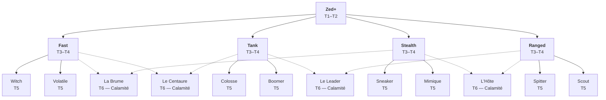

# ZED+

**Project Zomboid — Mod Design**

Design Bible — Système d'ennemis spéciaux, arbre d'évolution et comportements.

> ⚑ 4 points ouverts restent à définir — voir [Points ouverts](#points-ouverts).

---

## Sommaire

- [Mécanique de spawn](#mécanique-de-spawn)
- [Arbre d'évolution](#arbre-dévolution)
- [T1–T2 · Zombie Renforcé](#t1t2--zombie-renforcé)
- [T3–T4 · Voies](#t3t4--voies)
- [T5 · Formes finales](#t5--formes-finales)
- [T6 · Calamités](#t6--calamités)
- [Easter Egg · Thriller](#easter-egg--thriller)
- [Points ouverts](#points-ouverts)

---

## Mécanique de spawn

Le stade initial (T1–T4) est déterminé à l'apparition en fonction du jour d'apocalypse. À partir du T4, une évolution
dynamique est possible : tenter de devenir une Calamité si les conditions de zone sont réunies, ou évoluer vers le T5
après 4 jours de survie sans y parvenir. **Le T4 est une forme transitoire** — il cherche sa prochaine issue.

| Règle | Valeur |
|---|---|
| **Taux d'apparition** | ~1 Zed+ sur 400 zombies normaux |
| **Seuils de stade (spawn)** | T1–T2 : Jour 0+ · T3–T4 : Jour 7+ · T5 : via T4, 4 jours de survie · T6 : via T4, conditions de zone |
| **Condition T4 → T5** | Un T4 qui n'a pas pu devenir Calamité évolue en T5 après **4 jours de survie** dans le monde |
| **Condition T4 → T6** | Aucune Calamité dans un rayon de **150 tiles** *et* **≥ 25 zombies** dans la zone *(valeur configurable)* |
| **Exclusion régionale** | 1 seule Calamité active par rayon de 150 tiles. **Refus définitif** si le slot est occupé — le T4 ne peut jamais réessayer |
| **Calamités pré-placées** | Certaines Calamités sont fixées en début de partie près de bâtiments importants de la carte. Elles occupent le slot régional comme une Calamité vivante |

---

## Arbre d'évolution

- **Trait plein** — `T4 → T5` : après 4 jours de survie
- **Trait pointillé** — `T4 → T6` : si les conditions de zone sont réunies (court-circuite le T5)

---

## T1–T2 · Zombie Renforcé

**Jours 0+**

Indiscernable d'un zombie ordinaire — même apparence, mêmes sons, même comportement apparent. Stats légèrement
supérieures. Le joueur ne sait pas qu'il a affaire à un Zed+. Les tenues custom et comportements distinctifs
n'apparaissent qu'à partir du T5.

---

## T3–T4 · Voies

**Jours 7+ · Spécialisations**

Différenciation **uniquement comportementale** — le Zed+ reste visuellement identique à un zombie ordinaire. La voie
est tirée aléatoirement à l'apparition et détermine les formes T5 accessibles.

| Voie | Comportement |
|---|---|
| **Fast** | Plus rapide que la normale, moins résistant. *Apparence identique à un zombie normal.* Seule la vitesse le trahit. |
| **Tank** | Nettement plus lent, mais bien plus résistant. *Apparence identique à un zombie normal.* Difficile à distinguer sans l'attaquer. |
| **Stealth** | N'aggro le joueur que de très près. Reste allongé ou immobile dans les coins de bâtiments. *Apparence et sons normaux.* |
| **Ranged** | Dégage un gaz de putréfaction. *Apparence normale.* La corpse sickness inhabituelle dans la zone peut alerter un joueur attentif. |

---

## T5 · Formes finales

**Jours 21+ · Mini-boss**

Forme définitive tirée aléatoirement parmi les deux options de la voie. Comportement entièrement distinct.

### Voie Fast

#### Witch — *Passive et dangereuse*

| Vitesse | Résistance | Aggro |
|---|---|---|
| ×1.5 | Normale | Conditionnelle |

Reste immobile, assise ou debout, jusqu'à ce qu'un joueur fasse trop de bruit à proximité, l'éclaire directement, ou
s'approche trop. Dès lors, elle pousse un unique hurlement et charge sans jamais décrocher.

> **Mécanique clé** — Une fois aggrée, la poursuite est permanente : même si le joueur monte en voiture et s'éloigne,
> la Witch maintient le cap indéfiniment.

#### Volatile — *Drone biologique aérien* ⚑

| Vitesse | Résistance | Vol |
|---|---|---|
| Rapide | Faible | Oui |

Se déplace en vol simulé, franchissant clôtures et palissades. Dès qu'il repère un joueur, il émet 2 à 3 cris
d'alerte pour attirer les zombies de la zone, puis meurt naturellement.

> **Mécanique clé** — Vol : traverse toutes les fences et tall fences. N'attaque pas — son unique rôle est l'alerte de
> zone avant de s'éteindre.

> ⚑ **À définir** — durée de vie après l'alerte.

### Voie Tank

#### Colosse — *Mur de chair lente*

| Vitesse | Résistance | Stagger |
|---|---|---|
| Très lente | Très haute | Presque nul |

Se déplace lentement et inexorablement vers le joueur. Le stagger ne l'affecte presque pas — continuer à frapper ne le
repousse pas.

> **Résistances** — `×2` dégâts armes tranchantes · `×0.5` armes contondantes

`Faiblesse : armes tranchantes ×2` · `Résistance : blunt ×0.5`

#### Boomer — *Bombe ambulante* ⚑

| Vitesse | Résistance | Danger |
|---|---|---|
| Extrêmement lente | Haute | Explosion |

Se dirige lentement vers le joueur dès qu'il le repère. À 4–5 tiles, il s'immobilise et pousse un cri. L'explosion
survient 4 secondes plus tard.

> **Explosion** — Lourds dégâts directs + projection d'acide sur les cellules proches (même effet que le Spitter).

> ⚑ **À définir** — uniformiser l'effet acide avec le Spitter.

### Voie Stealth

#### Sneaker — *Toujours dans le dos*

| Vitesse | Résistance | Son |
|---|---|---|
| Modérée/rapide | Normale | Respiration |

S'efforce de maintenir une position dans le dos du joueur. Il ne produit pas les sons gutturaux habituels — uniquement
une respiration haletante, détectable à l'écoute.

> **Détection** — Le joueur peut le repérer via le son de sa respiration. Aucun grognement, aucune alerte sonore
> classique.

#### Mimique — *Le cadavre qui attend* ⚑

| Vitesse | Résistance | Réveil |
|---|---|---|
| Rampant | Normale | Fouille / Contact |

Reste allongé au sol, indiscernable d'un cadavre ordinaire. Se réveille si le joueur passe directement sur lui ou
tente de le fouiller. Il renverse le joueur (résistance en fonction de la fitness) et s'attaque à ses pieds.

> **Après réveil** — Devient un rampant permanent jusqu'à réendormissement. Peut retourner à son état dormant si le
> joueur s'éloigne suffisamment.

> ⚑ **À définir** — conditions de réendormissement.

### Voie Ranged

#### Spitter — *Contrôle de zone acide*

| Vitesse | Résistance | Portée |
|---|---|---|
| Modérée | Normale | Distance |

Lance des flaques d'acide persistantes au sol. Un joueur qui stationne 0.5 seconde dans une flaque déclenche les
effets : corrosion de l'équipement et brûlures sur les parties non couvertes.

> **Délai de 0.5 s** — Le joueur peut traverser rapidement la zone sans dégâts : la pénalité vise ceux qui ne
> réagissent pas. Les flaques ont une durée de vie limitée.

#### Scout — *Alarme vivante*

| Vitesse | Résistance | Alerte |
|---|---|---|
| Rapide | Faible | Très large |

Dès qu'il repère un joueur, il fonce dans sa direction à vitesse rapide tout en hurlant continuellement. Son cri
attire les zombies sur une portée comparable à un tir d'arme à feu.

> **Rôle Ranged** — Son danger n'est pas lui-même, c'est la horde qu'il convoque. L'éliminer silencieusement avant
> qu'il crie est la priorité.

---

## T6 · Calamités

**4 Calamités · Voie spéciale T4 → T6**

Une Calamité par région (rayon ~150 tiles). Le passage T4→T6 court-circuite le T5 — c'est la priorité du T4, mais les
conditions doivent être réunies. **Un T4 refusé ne peut jamais réessayer** : il reste T4 jusqu'à sa mort, ou évolue
vers le T5 après 4 jours. Certaines Calamités sont pré-placées en début de partie près de bâtiments importants.

Chaque Calamité hérite de deux classes ; chaque classe apparaît dans exactement deux Calamités.

| Calamité | Classes | Accessible depuis |
|---|---|---|
| **L'Hôte** | Stealth + Ranged | T4 Stealth ou T4 Ranged |
| **La Brume** | Fast + Stealth | T4 Fast ou T4 Stealth |
| **Le Leader** | Tank + Ranged | T4 Tank ou T4 Ranged |
| **Le Centaure** | Fast + Tank | T4 Fast ou T4 Tank |

### L'Hôte — *Usine à zombies*

`Stealth · Ranged`

| Vitesse | Résistance | Attaque |
|---|---|---|
| Immobile | Extrême | Aucune |

Couché au sol, indiscernable d'un cadavre ordinaire. Incapable de se mouvoir ou d'attaquer. Tant qu'il est en vie, il
génère continuellement des Zed+ T1–T2 lorsqu'un joueur approche ou qu'un bruit fort est perçu (tir, hélicoptère…). Sa
nature Stealth le rend difficile à repérer ; sa nature Ranged lui confère une portée de génération élevée.

> **Priorité** — Il faut l'éliminer pour stopper le flux. Très difficile à tuer sans se faire déborder par ses propres
> créations.

### La Brume — *Fumigène vivant*

`Fast · Stealth`

| Vitesse | Résistance | Zone |
|---|---|---|
| Rapide | Faible | Fumée dense |

Se déplace rapidement et imprévisiblement en émettant en continu un nuage de fumée dense — même effet qu'un fumigène
vanilla. La visibilité dans son sillage est quasi nulle. Sa nature Stealth la rend extrêmement difficile à localiser
dans sa propre fumée. Elle ne combat pas : son rôle est de créer une zone aveugle pour les zombies qui suivent.

> **Implémentation** — Spawn continu de `IsoSmokeEmitter` (objet vanilla) sur la position de La Brume à chaque tick.
> La fumée disparaît naturellement après quelques secondes, mais la Brume se déplace et en génère sans cesse.

> **Contre-jeu** — L'éliminer à distance avant qu'elle s'approche : une fois dans son nuage, la viser est très
> difficile. Tirer au son. Résistance faible — elle meurt vite si on la touche.

### Le Leader — *Commandant de horde*

`Tank · Ranged`

| Vitesse | Résistance | Taille |
|---|---|---|
| Très lente | Haute | Exceptionnelle |

Masse imposante et lente autour de laquelle les zombies s'agglutinent naturellement. Dès qu'il repère un joueur, il
attrape un zombie parmi ceux qui l'entourent et le projette à toute vitesse vers la cible. Le zombie impacté devient
rampant au sol. Sans zombies à portée, le Leader avance et frappe au corps-à-corps pour des dégâts lourds.

> **Implémentation projectile** — Déplacement rapide du zombie cible via `setX()`/`setY()` par ticks. À l'impact
> (~1 tile du joueur) : dégâts + état rampant. Piste à explorer : `ThrowableProjectile` Java pour un arc visuel réel.

`Vulnérable sans escorte` · `Éliminer la horde d'abord`

### Le Centaure — *Le sprinter inarrêtable*

`Fast · Tank`

| Vitesse | Résistance | Stagger |
|---|---|---|
| Extrême | Haute | Nul en charge |

Sprint à vitesse extrême vers le joueur en cycles de charge. Pendant la charge, aucun stagger ne peut l'arrêter — il
traverse la horde environnante et détruit sur son passage tout obstacle cassable : fenêtres, portes, clôtures. Seuls
les murs solides l'arrêtent. À l'impact : dégâts lourds et forte projection du joueur. Après chaque charge, il marque
une courte pause avant de repartir.

> **Destruction en charge** — Vérification tile par tile de la trajectoire via `IsoThumpable` : destruction forcée de
> tout objet cassable sur le chemin. Les murs solides (non-thumpables) bloquent et cassent la charge. Permet de
> défoncer une base légèrement fortifiée si le joueur ne sort pas à sa rencontre.

> **Contre-jeu** — Les phases de pause entre deux charges sont le seul moment d'attaque sûr. Esquiver sur le côté au
> dernier moment est la technique principale : le Centaure ne freine pas et repart loin dans la direction de la charge.

`Pause post-charge` · `Murs solides = stop net` · `Obstacles cassables ignorés`

---

## Easter Egg · Thriller

**Événement ultra-rare**

Sur certaines routes, une chance infime de tomber sur quelque chose d'inattendu — un groupe de zombies qui danse.
Inspiré d'*Armageddon Riders* et de *Michael Jackson's Thriller*.

| | |
|---|---|
| **Déclenchement** | Chance ultra-rare à la traversée d'un segment de route. Indépendant du système Zed+. |
| **Composition** | 5 à 8 zombies ordinaires en cercle · 1 zombie central en tenue orange (outfit dédié) |
| **Son** | Boucle audio "Thriller" modifiée jouée en son monde (volume faible, rayon ~15 tiles). Disparaît si les zombies meurent. |
| **Comportement** | Zombies en rotation lente sur eux-mêmes (`setFacing()` cyclique). Ils aggrèrent normalement si le joueur s'approche — la danse cesse. |
| **Implémentation son** | Fichier `.ogg` custom dans `media/sound/` · déclenché via `getSoundManager():PlayWorldSound()` |
| **Limites connues** | Pas d'animation "danse" native en Lua — simulé via rotation + son. L'effet repose sur la surprise du joueur plus que sur le visuel. |

---

## Points ouverts

1. **Volatile** — durée de vie exacte après l'alerte, avant la mort naturelle
2. **Boomer / Spitter** — uniformiser l'effet acide (même implémentation)
3. **Mimique** — conditions exactes de réendormissement (distance ? timer ?)
4. **Scout** — comportement exact au contact (attaque au corps-à-corps ? ou fuite ?)

---

## Documentation du projet

| Fichier | Contenu |
|---|---|
| `README.md` | Ce document — la design bible de référence |
| [zedplus-design-bible.md](zedplus-design-bible.md) | Version condensée + notes techniques (structure du mod, persistance, modData) |
| [pz-zedplus-design.html](pz-zedplus-design.html) | Version HTML mise en page (source de ce README) |
| [CLAUDE.md](CLAUDE.md) | Repères d'implémentation : environnement, layout Build 42, architecture |
